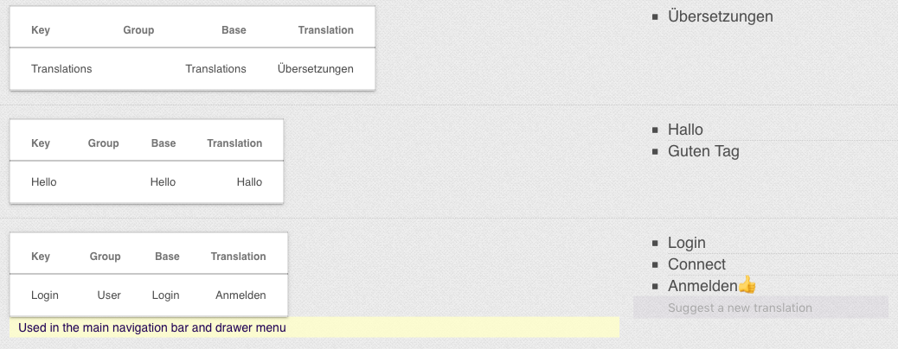

#CrowdWorld

##*UNDER DEVELOPMENT*

Some things doesn't work yet. Searching....

A localization tool for "Pharo" and "Seaside". It uses MongoDB to store the phrases and their translations. The localization component let users vote between several translations, or to suggest their own.
 



##TODO
- Tests
- Documentation

##Installation

```
Metacello new
    githubUser: 'Fulnir' project: 'Pharo-CrowdWorld' commitish: 'development' path: 'repository';
    baseline: 'CrowdWorld';
    onWarningLog;
    load
```

##Integration

###Session

Some changes in your `WASession` subclass.

User must me logged in.

```
isLoggedIn
	"Replace with your user code"

	^ true
```


Only a admin can **lock** a translation.


```
isAdmin
	"Replace with your user code"

	^ true
```

## Localize String

To localize a phrase in your `WAComponent`subclass, use the following method. The method `localize:` returns the localized term if available or the phrase key.


| Key         | Base        | Translation-en |
| ----------- | :------- | :------------- |
| NavBarLogin | Login | Login |


```
self localize: 'aPhraseKey'
```

All translations are cached in the class `CWNaturalLanguageTranslator`. There is no need to access the database for every string to localize.

Untranslated prases cached in the class variable `CWAllKnownPhrasesSet` and localized phrases are cached in the class variable `CWAllKnownTranslatedPhrasesDictionary`

## Voting

